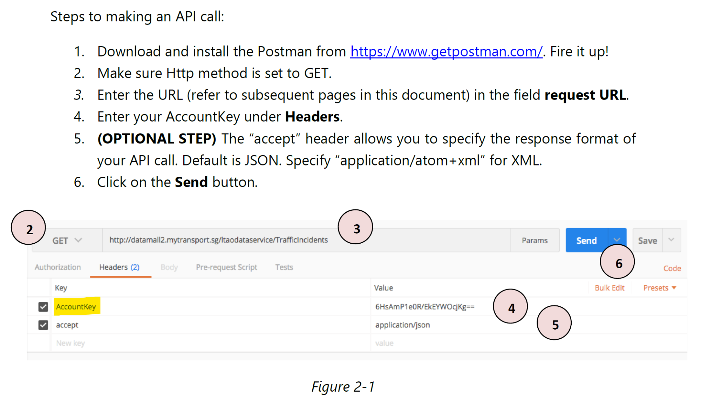
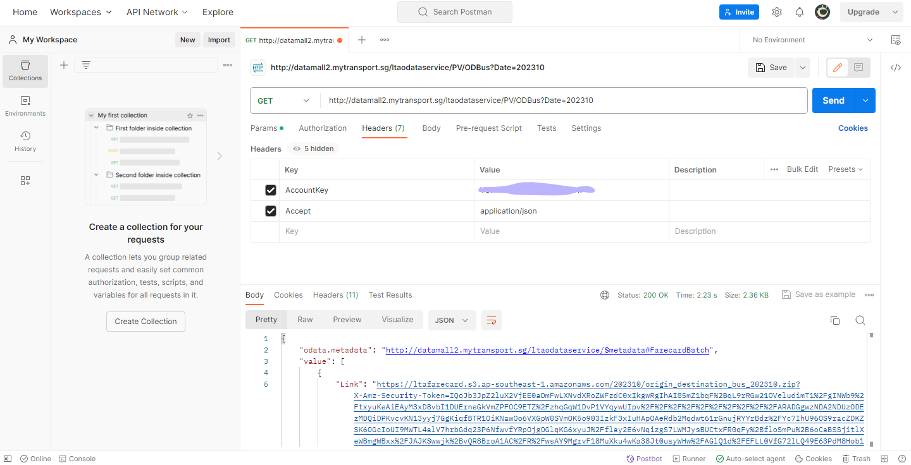
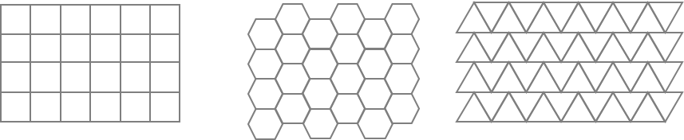
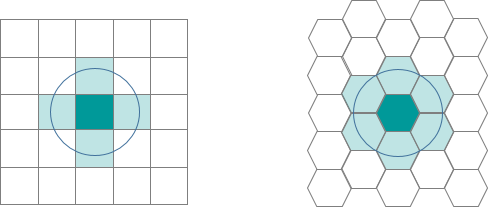

## Learning Outcome

By the end of this hands-on exercise, you will be able to:

-   download dynamic data by using LTA DataMall API and [postman](https://www.postman.com/);
-   import and tidy geospatial data using sf and tidyverse;
-   import and tidy aspatial data using tidyverse;
-   create analytic hexagon data using sf;
-   prepare

## Loading the R package

::::: panel-tabset
### The task

Write a code chunk to install and load tidyverse, sf, sfdep, tmap, knitr, kableExtra, and DT into R environment.

::: callout-note
-   tidyverse, a family of modern R packages specially developed for performing data science tasks,
-   sf, a modern R package specially developed for performing geospatial data science tasks except visualising geospatial data;
-   tmap, an R package for create elegant thematic maps based on the principles of Layered Grammar of Graphics;
-   knitr, an R package that provide an elegant, flexible, and fast static table generation with R;
-   kableExtra, an extension of knitr for creating elegant html table with R; and
-   DT, an R package DT provides an R interface to the JavaScript library DataTables for create interactive htnl tables.
:::

### The code

::: {style="font-size: 1.50em"}
```{r}
pacman::p_load(tidyverse, sf, sfdep, tmap, knitr, kableExtra, DT)
```
:::
:::::

## Extracting and Downloading Data Using LTA DataMall API

Follow the steps below to install postman desktop and make an API call.



------------------------------------------------------------------------

### Downloading the dynamic data

Copy the url provide in line 5, must start from `https://` onwards, then from the web browser, start a new page. Next, paste the url on the new page. The file will start download onto your computer.



## Importing Data

:::::::: panel-tabset
### The task

Write code chunks to perform the followings:

-   Importing *Bus Stop Location* shapefile downloaded from LTA DataMall into R environment.
-   Importing Master Plan 2019 Subzone Boundary (No Sea) from Singapore’s open data portal.
-   Importing *Passenger Volume by Origin Destination Bus Stops* downloaded from LTA DataMall into R environment.

### Bus Stop Location

::: {style="font-size: 1.50em"}
```{r}
BusStop = st_read(dsn = "data/LTADataMall/", 
                  layer = "BusStop") %>%
  st_transform(crs = 3414)
```
:::

### Master Plan 2019 Subzone

::: {style="font-size: 1.50em"}
```{r}
mpsz = read_rds("data/rds/mpsz_sf.rds")
```
:::

::: callout-note
Refer to [2.3.2 Importing Geospatial Data into R](https://r4gdsa.netlify.app/chap02#importing-geospatial-data-into-r) of R for Geospatial Data Science and Analytics to learn how to import and tidy a kml file.
:::

### O-D Bus Trips

::: {style="font-size: 1.50em"}
```{r}
odbus <- read_csv("data/LTADataMall/origin_destination_bus_202508.csv")
```
:::

::: callout-note
`read_csv()` of **readr** package should be used instead of `read.csv()` of of Base R.
:::
::::::::

------------------------------------------------------------------------

### Visualising the geospatial data

::::::: columns
::::: {.column width="50%"}
::: callout-important
When working with geospatial data, it is highly recommended to visualise the geospatial data by using appropriate thematic mapping method(s).
:::

::: callout-note
Actually, those bus stops are located along the Singapore-Johor Bahru causeway.
:::
:::::

::: {.column width="50%"}
Figure below reveals that there a several bus stops (i.e black dots appear at the upper left) located outside of the main Singapore boundary.

```{r}
#| echo: false
tm_shape(mpsz) + 
  tm_polygons() + 
tm_shape(BusStop) +
  tm_dots()
```
:::
:::::::

------------------------------------------------------------------------

### Extracting Bus Stops located within Singapore

:::::::::::: panel-tabset
#### The code

:::::: columns
::::: {.column width="50%"}
In the code chunk below, `st_join()` of sf package is used to select all bus stops located within Singapore main island.

::: {style="font-size: 1.50em"}
```{r}
BusStop_in_SG <- st_join(
  BusStop, mpsz, 
  join = st_within, 
  left = FALSE)
```
:::

::: callout-tip
Refer to [`st_join()`](https://r-spatial.github.io/sf/reference/st_join.html) to learn more about `st_join()` and other related functions.
:::
:::::
::::::

#### The plot

::::::: columns
:::: {.column width="\"50%"}
::: calout-note
Figure below reveals that all bus stops located outside of Singapore main island have been excluded.
:::

```{r}
#| echo: false
tm_shape(mpsz) + 
  tm_polygons() + 
tm_shape(BusStop_in_SG) +
  tm_dots()
```
::::

:::: {.column width="\"50%"}
::: callout-tip
#### Question:

Do you know how many bus stops are located outside of Singapore main island? Describe how the answer was derives.
:::
::::
:::::::
::::::::::::

## Analytical Hexagon

::: panel-tabset
### Why Analytical Grids?

In geospatial analysis, regularly shaped grids are used for many reasons such as normalizing geography for mapping or to mitigate the issues of using irregularly shaped polygons created arbitrarily (such as county boundaries or block groups that have been created from a political process). Regularly shaped grids can only be comprised of **equilateral triangles**, **squares**, or **hexagons**, as these three polygon shapes are the only three that can tessellate (repeating the same shape over and over again, edge to edge, to cover an area without gaps or overlaps) to create an evenly spaced grid.

{fig-align="center" width="1222"}

### Why hexagon?

Hexagons reduce sampling bias due to edge effects of the grid shape, this is related to the low perimeter-to-area ratio of the shape of the hexagon. A circle has the lowest ratio but cannot tessellate to form a continuous grid. Hexagons are the most circular-shaped polygon that can tessellate to form an evenly spaced grid.

{fig-align="center" width="800"}
:::

## Deriving Analytical Hexagon

:::::: panel-tabset
### The task

Create analytics hexagon layer cover the entire Singapore.


### The code

In the code chunk below, `st_make_grid()` of sf package is used to create the hexagon data set.

::: callout-important
It is high-recommended to read the reference guide of [`st_make_grid()`](https://r-spatial.github.io/sf/reference/st_make_grid.html) to understand the usage of it.
:::

::: {style="font-size: 1.50em"}
```{r}
hexagon <- st_make_grid(mpsz, 
                        cellsize = 700,
                        what = "polygon",
                        square = FALSE) %>%
  st_sf()
```
:::

::: callout-warning
The output of `st_make_grid()` is an object of class **sfc** (simple feature geometry list column) with, depending on what and square, square or hexagonal polygons, corner points of these polygons, or center points of these polygons. Hence, `st_sf()` is needed to covert it to simple polygon feature data frame.
:::
::::::

------------------------------------------------------------------------

### Checking the hexagon layer visually

::: callout-tip
Similarly, it is highly recommended to display the newly derived hexagon data.
:::

::: {style="font-size: 1.50em"}
```{r}
#| echo: false
tm_shape(hexagon) +
  tm_fill(col = "white", title = "Hexagons") +
  tm_borders(alpha = 0.5) +
  tm_layout(main.title = "Analytical hexagon layer overplot on Singapore",
            main.title.position = "center",
            main.title.size = 1.0,
            legend.height = 0.35, 
            legend.width = 0.35,
            frame = TRUE) +
  tm_compass(type="8star", size = 2, bg.color = "white", bg.alpha = 0.5) +
  tm_scale_bar(bg.color = "white", bg.alpha = 0.5) +
  tm_shape(mpsz) +
  tm_fill("green", title = "Singapore Boundary", alpha = 0.5) +
  tm_shape(BusStop_in_SG) +
  tm_dots(col = "red", size = 0.005, title = "Bus Stops")

```
:::

::: callout-node
Figure above reveals that there are many hexagons without any bus stop in they. Some of them are located outside Singapore main island.
:::

## Selecting hexagons with bus stops

::::::: panel-tabset
### The code

:::::: columns
::: {.column width="50%"}
Code chunk on the right eliminates hexagons without bus stop from the initial hexagon layer. It consists of three steps:

1.  a new field called *busstop_count* is created.
2.  `st_intersects()` is used to flag out bus stop located inside a hexagon. Then, `length()` is used to count the number of bus stops located inside a hexagon.
3.  Lastly, `filter()` is used to select hexagons with at least one bus stop found.
:::

:::: {.column width="50%"}
::: {style="font-size: 1.50em"}
```{r}
hexagon$busstop_count =
  lengths(st_intersects(
    hexagon, BusStop_in_SG))

hexagon <- filter(
  hexagon, busstop_count > 0)
```
:::
::::
::::::

### Checking the hexagon layer visually

```{r}
#| echo: false
#| fig-width: 10
#| fig-height: 5
tm_shape(mpsz) +
  tm_fill("green", title = "Singapore Boundary", alpha = 0.5) +
  tm_shape(hexagon) +
  tm_fill(col = "white", title = "Hexagons", alpha = 1) +
  tm_borders(alpha = 0.2) +
  tm_layout(main.title = "Analytical hexagon layer overplot on Singapore",
            main.title.position = "center",
            main.title.size = 1.0,
            legend.height = 0.35, 
            legend.width = 0.35,
            frame = TRUE) +
  tm_compass(type="8star", size = 2, bg.color = "white", bg.alpha = 0.5) +
  tm_scale_bar(bg.color = "white", bg.alpha = 0.5) +
  tm_shape(BusStop_in_SG) +
  tm_dots(col = "red", size = 0.001, title = "Bus Stops") +
  tm_grid(alpha = 0.2)
```

Notice that only hexagons with bus stops remain.
:::::::

------------------------------------------------------------------------

### Assigning ids to each hexagon

::::::::::: panel-tabset
#### The issue

:::: columns
::: {.column width="50%"}
Let us examine the content of hexagon sf data frame below. Notice that the data frame does not include an ID field.

```{r}
#| echo: false
kable(head(hexagon)) %>%
  kable_styling(font_size = 24)
```
:::
::::

#### The solution

:::::::: columns
::::: {.column width="50%"}
::: {style="font-size: 1.50em"}
```{r}
hexagon <- hexagon %>% 
  select(, -busstop_count)

hexagon$HEX_ID <- sprintf(
  "H%04d", seq_len(
    nrow(hexagon))) %>% 
  as.factor()
```
:::

::: callout-note
1.  `select()` is used to drop *busstop_count* field from the sf data frame.
2.  A new feld called *HEX_ID* is created. Then, `sprintf()`, `seq_len()` and `nrow()` are used to insert sequential ID values with a character H in front.
3.  `as.factor()` is used to convert the values into factor data type.
:::
:::::

:::: {.column width="50%"}
::: callout-note
Notice that a new ID column called *HEX_ID* has been added into hexagon data frame and the values are 5-digit running number start with the letter H. At the same time, *busstop_count* field has been dropped from the data frame.
:::

```{r}
#| echo: false
kable(head(hexagon)) %>%
  kable_styling(font_size = 24)
```
::::
::::::::
:::::::::::

## Preparing Trip Generation Data

### Cleaning the data

::::::: panel-tabset
#### The task

::::: columns
:::: {.column width="50%"}
::: {style="font-size: 0.80em"}
Before going deep in the wrangling, we will clean up the data so that we are left with a lightweight data set that R can process more easily.

1.  We will retain and rename columns below to make them more understandable and easier to join with other data sets.
2.  We will also rename the columns to make them more understandable and will make joining with other data sets easier.
3.  Lastly, will also convert *BUS_STOP_N* to factor as it has a finite set of values so we can convert it to categorical data to make it easier to work with.
:::
::::
:::::

#### The code

::: {style="font-size: 1.50em"}
```{r}
trips <- odbus %>%
  select(c(ORIGIN_PT_CODE, DAY_TYPE, TIME_PER_HOUR, TOTAL_TRIPS)) %>%
  rename(BUS_STOP_N = ORIGIN_PT_CODE) %>%
  rename(HOUR_OF_DAY = TIME_PER_HOUR) %>%
  rename(TRIPS = TOTAL_TRIPS)
trips$BUS_STOP_N <- as.factor(trips$BUS_STOP_N)
```
:::

#### The tidied sf data frame

```{r}
#| echo: false
kable(head(trips))
```
:::::::

------------------------------------------------------------------------

### Populating Hexagon IDs into BusStop data frame

:::: panel-tabset
### The task

Before we can aggregate trips generate at bus stops onto hexagon level, we need to populate the hexagon ids in hexagon data frame into BusStop data frame.

::: {style="font-size: 1.50em"}
```{r}
bs_hex <- st_intersection(
  BusStop, hexagon) %>%
  st_drop_geometry() %>%
  select(c(BUS_STOP_N, HEX_ID))
```
:::

### The bs_hex data frame

```{r}
#| echo: false
kable(head(bs_hex))
```
::::

------------------------------------------------------------------------

### Adding HEX_ID into bus trips data

:::: panel-tabset
#### The task and code chunk

To derive the hourly number of bus trips per hexagon, we need to add *HEX_ID* to trips data. By doing so, we will be able to aswer location questions such as how many bus trip originate from a certain hexagon?

In the code chunk below `inner_join()` is used to join the *trips* data with *bs_hex*.

::: {style="font-size: 1.50em"}
```{r}
trips <- inner_join(trips, bs_hex)
```
:::

#### The revised trips data frame

```{r}
#| echo: false
kable(head(trips))
```
::::

------------------------------------------------------------------------

### Aggregating TRIPS based on HEX_ID

:::: panel-tabset
#### The code

In the code chunk below, `group_by()` and `summarise()` is used to aggregate *TRIPS* by *HEX_ID*, *DAY_TYPE* and *HOUR_OF_DAY*.

::: {style="font-size: 1.50em"}
```{r}
trips <- trips %>%
  group_by(
    HEX_ID,
    DAY_TYPE,
    HOUR_OF_DAY) %>%
  summarise(TRIPS = sum(TRIPS))
```
:::

#### The trips data frame

The revised trip data frame should look similar to the table below.

```{r}
#| echo: false
htmltools::div(
  style = "font-size: 18px;
  width: 80%;
  margin: auto;",
  DT::datatable(
    trips,
    options = list(
      pageLength = 10,
      scrollY = 500,
      scrollX = TRUE
    )
  )
)
```
::::
