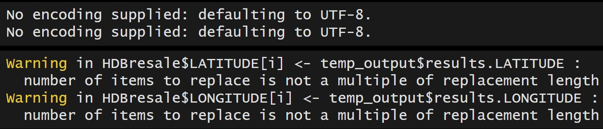

## Learning outcomes

By the end of this in-class exercise, students will master the skill of:

- prepare and geocode HDB resale price data for geospatial modelling; and
- perform proximity analysis to count the number of geographic entities located within a defined distance from each HDB property.

## Installing and Loading R packages

For this in-class exercise, one new package called **jsonlite** will be installed and loaded onto R environment.  It will be used to parse json file into R as data frame.  

```{r}
pacman::p_load(httr, tidyverse, sf, tmap, 
               jsonlite, progress)
```

## Geocoding HDB resale data

In this section, you will learn how to geocode HDB resale data by using SLA Onemap Geocode API.  First on all, students must download *Resale flat prices based on registration date from Jan-2017 onwards* from [Singapore's
open data portal](data.gov.sg).

### Selecting data of interest

This data set comprises of HDB resale transactions from Jan 2017 onwards.  For the purpose of this in-class exercise, the code chunk below will be used to extract a sub-set of transaction records on 4-Room flat transacted on the month September 2025.  

::: callout-note
- The code chunk below assume that the downloaded HDB resale data are reside in data/rawdata folder of In-class_Ex08.  
- The data has been renamed to HDBresale in order to keep the file name short.
:::

```{r}
HDBresale <- read_csv(
  "data/rawdata/HDBresale.csv") %>%
  filter(flat_type == "4 ROOM") %>%
  filter(month >= "2025-09" & month < "2025-10")
```

Let us prepare a geocoding function by using the code chunk below.  It aims to perform the following tasks:

- Combining the block and street name into an address. The addresses will be used to geocode instead of postal code that you learned in In-class Exercise 3b,
- Passing the address as the **searchVal** in our query,
- Sending the query to **OneMapSG search**. Note: Since we don’t need all the address details, we can set getAddrDetails as ‘N’,
- Converting response (JSON object) to text,
- Saving response in text form as a dataframe, and 
- Retain the latitude and longitude for our output.

```{r}
geocode <- function(block, streetname) {
  base_url <- "https://onemap.gov.sg/api/common/elastic/search"
  address <- paste(block, streetname, sep = " ")
  query <- list("searchVal" = address, 
                "returnGeom" = "Y",
                "getAddrDetails" = "N",
                "pageNum" = "1")
  
  res <- GET(base_url, query = query)
  restext<-content(res, as="text")
  
  output <- fromJSON(restext)  %>% 
    as.data.frame %>%
    select(results.LATITUDE, results.LONGITUDE)

  return(output)
}
```

Next, the code chunk below will be used to to execute the geocoding function:

```{r}
HDBresale$LATITUDE <- 0
HDBresale$LONGITUDE <- 0

for (i in 1:nrow(HDBresale)){
  temp_output <- geocode(HDBresale[i, 4], HDBresale[i, 5])
  
  HDBresale$LATITUDE[i] <- temp_output$results.LATITUDE
  HDBresale$LONGITUDE[i] <- temp_output$results.LONGITUDE
}
```

::: callout-note
- Ignore the warning message as shown below.


- When the geocoding process ended, check the content of HDBresale tibble data frame to ensure that the latitude and longitude values of each records are filled.  If neceddary, delete records failed to geocode.
:::

## Proximity Analysis 

In this section, you will learn how to count the number of geographic entities located within a defined distance from each HDB property.

For the purpose of this exercise, we are interested to count the number of preschools located with 350m of each resale HDB unit.

### Converting to an sf object

Before performing proximity analysis, it is important to ensure that:

- both input data sets must be in sf objects, and
- they must be in similar projected coordinates systems.  

::: callout-note
In the code chunk below, 

- `st_as_sf()` is used to convert HDBresale tibble data.frame to sf object by using values from LONGITUDE and LATITUDE columns to form the geometry features.
- `st_transform()` is then used to transform the sf object into svy21 projected coordinates system.
- the output sf object is called *HDBresale_sf*.  It is in **sf data.frame** format.
:::

```{r}
HDBresale_sf <- HDBresale %>%
  st_as_sf(
    coords = c("LONGITUDE", "LATITUDE"),
    crs=4326) %>%
  st_transform(crs = 3414)
```

### Locate, download and import Preschool Location data

Next, we will locate and download *Pre-Schools Location* data from Singapore's open data portal.  There are both geojson and kml version.  In this exercise, the kml version will be used.

Then, code chunk below will be used to import the preschool location data into R environment by using `st_read()` of **readr** package.

```{r}
preschool = st_read(
  "data/rawdata/PreSchoolsLocation.kml") %>%
  st_transform(crs= 3414)
```

::: callout-note
`st-transform()` of **sf** package is used to transform the preschool sf dataframe from wgs84 geographic coodinates system to svy21 projected coordinates system (i.e. EPSG: 3414)
:::

### Counting number of preschools

Lastly, code chunk below will be used to count the number of pre-schools located within 350m of each HDB property.

```{r}
within_350m <- st_is_within_distance(
  HDBresale_sf, preschool, dist = 350)

HDBresale_sf <- HDBresale_sf %>%
  mutate(WITHIN_350M_PRISCHOOL = map_int(within_350m, length))
```

::: callout-note
- `st_is_within_distance()` of **sf** package is used to determines whether two spatial objects (HDB property and preschool) are within 350m distance of each other.  It returns a logical matrix (or a sparse list of indices if sparse = TRUE) indicating for each geometry in HDB property which geometries in preschool are within 350m distance.
- `mutate()` of dplyr is used to create a new field called *WITHIN_350M_PRISCHOOL*.
- `map_int()` of **purr** package is used to the number of preschools found in the newly created *WITHIN_350M_PRISCHOOL* field.
:::

### Computing shortest distance

Instead of counting number of preschools located within 350m of each HDB resale property, code chunk below is used to compute the distance between the nearest preschool from each HDB resale property.

```{r}
HDBresale_sf <- HDBresale_sf %>%
  mutate(
    PROX_PRESCHOOL = as.numeric(
      st_distance(geometry,
                  preschool[st_nearest_feature(
                    geometry, preschool), ], 
                  by_element = TRUE)
      )
    )
```

::: callout-note
The proximity values computed are in metres because svy21 projected coordinates system is in metres.
:::


