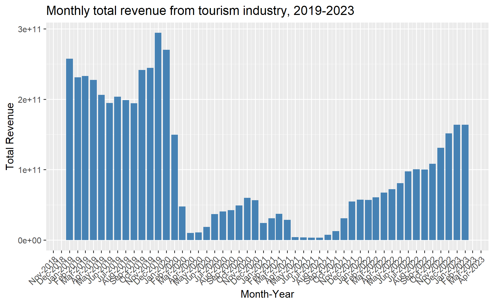
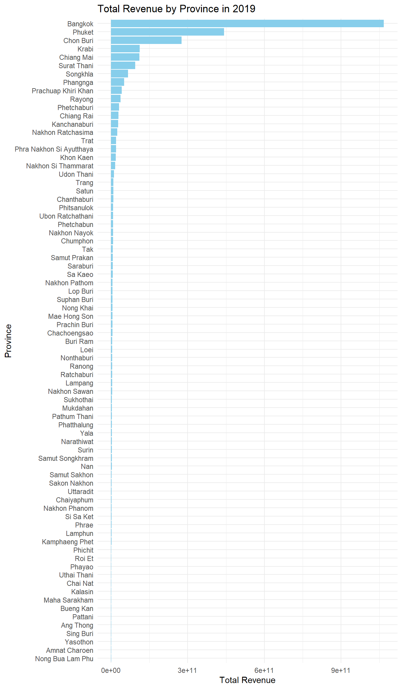

::: callout-important
This handout provides the context, the task, the expectation and the grading criteria of Take-home Exercise 2. Students must review and understand them before getting started with the take-home exercise.
:::

## Setting the Scene

Tourism is one of Thailand's largest industries, accounting for some 20% of the gross domestic product (GDP). In 2019, Thailand earned 90 billion US\$ from domestic and international tourism, but the COVID-19 pandemic caused revenues to crash to 24 billion US\$ in 2020.

Figure below shows the total revenue receipt from tourism sector from January 2019 until Feb 2023. The figure reveals that the revenue from tourism industry have been recovered gradually since September 2021.

However, it is important to note that the tourism economy of Thailand are not evenly distributed. Figure below reveals that the tourism economy of Thailand are mainly focus on five provinces, namely Bangkok, Phuket, Chiang Mai, Sukhothai and Phetchaburi.

## Objectives

As a curious geospatial analytics green horn, you are interested to discover:

-   if the key indicators of tourism economy of Thailand are independent from space and space and time.\
-   If the tourism economy is indeed spatial and spatio-temporal dependent, then, you would like to detect where are the clusters and outliers, and the emerging hot spot/cold spot areas.

## The Task

The specific tasks of this take-home exercise are as follows:

-   Using appropriate function of **sf** and **tidyverse**, preparing the following geospatial data layer:
    -   a study area layer in sf polygon features. It must be at [province level](https://en.wikipedia.org/wiki/Provinces_of_Thailand) (including Bangkok) of Thailand.
    -   a tourism economy indicators layer within the study area in sf polygon features.
    -   a derived tourism economy indicator layer in [**spacetime s3 class of sfdep**](https://sfdep.josiahparry.com/articles/spacetime-s3). Keep the time series at **month and year levels**.
-   Using the extracted data, perform global spatial autocorrelation analysis by using [sfdep methods](https://is415-gaa-tskam.netlify.app/in-class_ex/in-class_ex05/in-class_ex05-glsa).
-   Using the extracted data, perform local spatial autocorrelation analysis by using [sfdep methods](https://r4gdsa.netlify.app/chap10.html).
-   Using the extracted data, perform emerging hotspot analysis by using [sfdep methods](https://is415-gaa-tskam.netlify.app/in-class_ex/in-class_ex05/in-class_ex05-ehsa).
-   Describe the spatial patterns revealed by the analysis above.

## The Data

For the purpose of this take-home exercise, two data sets shall be used, they are:

-   [Thailand Domestic Tourism Statistics](https://www.kaggle.com/datasets/thaweewatboy/thailand-domestic-tourism-statistics) at Kaggle. You are required to use **version 2** of the data set.

-   [Thailand - Subnational Administrative Boundaries](https://data.humdata.org/dataset/cod-ab-tha?) at HDX. You are required to use the province boundary data set.

## Grading Criteria

This exercise will be graded by using the following criteria:

-   **Geospatial Data Wrangling (20 marks):** This is an important aspect of geospatial analytics. You will be assessed on your ability:

    -   to employ appropriate R functions from various R packages specifically designed for modern data science such as readxl, tidyverse (tidyr, dplyr, ggplot2), sf just to mention a few of them, to perform the import and extract the data.
    -   to clean and derive appropriate variables for meeting the analysis need.

::: callout-warning
All data are like vast grassland full of land mines. Your job is to clear those mines and not to step on them.
:::

-   **Geospatial Analysis (30 marks):** In this exercise, you are expected to use the appropriate global and local measures of spatial autocorrelation, and emerging hot spot analysis methods in class to perform the analysis. You will be assessed on your ability:

    -   to describe the methods used correctly, and
    -   to provide accurate interpretation of the analysis results.

-   **Geovisualisation and geocommunication (20 marks):** In this section, you will be assessed on your ability to communicate the results in business friendly visual representations. This course is geospatial centric, hence, it is important for you to demonstrate your competency in using appropriate geovisualisation techniques to reveal and communicate the findings of your analysis.

-   **Reproducibility (15 marks):** This is an important learning outcome of this exercise. You will be assessed on your ability to provide a comprehensive documentation of the analysis procedures in the form of code chunks of Quarto. It is important to note that it is not enough by merely providing the code chunk without any explanation on the purpose and R function(s) used.

-   **Bonus (15 marks):** Demonstrate your ability to employ methods beyond what you had learned in class to gain insights from the data.

## Submission Instructions

-   The write-up of the take-home exercise must be in **Quarto html document** format. You are required to publish the write-up on [**Netlify**](https://www.netlify.com/).
-   Zip the take-home exercise folder and upload it onto eLearn. If the size of the zip file is beyond the capacity of eLearn, you can upload it on SMU OneDrive and provide the download link on eLearn..

## Due Date

13th October 2024 (Sunday), 11.59pm (midnight).

## Learning from senior

You are advised to review these sample submissions prepared by your seniors.

-   [CHUA YAN TING](https://isss624-amelia.netlify.app/exercises/take-home_ex1/take-home_ex1): Have done well in all five grading criteria especially the geocommunication criterion.
-   [LIN SHUYAN](https://lins-92-isss624.netlify.app/take-home_ex01/take-home_ex01) Geospatial data wrangling is very comprehensively done especially identifying water points located outside Nigeria administrative boundary due to location precision issue.
-   [LOH SI YING](https://lohsiying.netlify.app/take_home_ex/ex1/take-home-ex1.html) Have done well in all five grading criteria especially the followings: (i) the geospatial wrangling are very comprehensively done including to exclude LGAs without water points from the analysis, (ii) managed to compute the p-values, (iii) Start each analysis by explaining the purpose of the analysis. Managed to relate the analysis results to the location context.

## Learning from IS415

-   [KHANT MIN NAING](https://is415-geospatial-with-khant.netlify.app/take-home_ex/take-home_ex02/take-home_ex02): Very well done in all the five grading criteria especially the ability to provide a comprehensive overview of the analysis methods used and discussion on the analysis results.
-   [MATTHEW HO YIWEN](https://is415-gaa-matthew-ho.netlify.app/takehomeex/takehomeex2/the2) Able to provide a clear and comprehensive discussion on the geospatial data wrangling process and to communicate the analysis results by using appropriate geovisualisation and data visualisation methods.

## Q & A

Please submit your questions or queries related to this take-home exercise on Piazza.

## Peer Learning

- [Christover Manafe](https://isss626-camanafe.netlify.app/take_home_ex/take_home_ex02/take_home_ex02)
- [Stephen Tay](https://geospatialanalytics-stephentay.netlify.app/take-home_ex/take-home_ex02/take-home_ex02)

## Reference

-   [IMPACT OF COVID-19 ON THAILAND’S TOURISM SECTOR](https://www.adb.org/sites/default/files/linked-documents/54177-001-sd-12.pdf)
-   [Covid: Thailand tourism up but still below pre-pandemic level](https://www.bbc.com/news/business-64369279)
-   [Tourism in Thailand](https://en.wikipedia.org/wiki/Tourism_in_Thailand)

### Research articles

-   Uglješa Stankov et. al. (2017) "Spatial autocorrelation analysis of tourist arrivals using municipal data: A Serbian example", *Geographica Pannonica*, Vol.21 (2), p.106-114. SMU e-journal.
-   Khan, D. et. al. (2017) "[Hot spots, cluster detection and spatial outlier analysis of teen birth rates in the U.S., 2003–2012](https://www.ncbi.nlm.nih.gov/pmc/articles/PMC5618106/)", *Spatial and Spatio-temporal Epidemiology*, Vol. 21, pp. 67–75.
-   Muhammad Arif & Didit Purnomo (2017) "[Measuring Spatial Cluster for Leading Industries in Surakarta with Exploratory Spatial Data Analysis (ESDA)](https://journals.ums.ac.id/index.php/JEP/article/view/4178/0)", *Jurnal Ekonomi Pembangunan*, Vol. 18 (1), pp. 64-81.
-   Joshua T. Fergen \* and Ryan D. Bergstrom (2021) "[Social Vulnerability across the Great Lakes Basin: A County-Level Comparative and Spatial Analysis](https://www.mdpi.com/2071-1050/13/13/7274)", *Sustainability*, Vol. 13(13).
-   V Putrenko, N Pashynska, and S Nazarenko (2018) "Data Mining of Network Events With Space-Time Cube Application". In: R Westerholt, F-B Mocnik, and A Zipf (eds.), *Proceedings of the 1st Workshop on Platial Analysis* (PLATIAL’18), pp. 75–82. SMU e-journal.
-   Jamie Anne Boschan and Caterina G. Roman (2024) "[Hot Spots of Gun Violence in the Era of Focused Deterrence: A Space-Time Analysis of Shootings in South Philadelphia](https://www.mdpi.com/2076-0760/13/2/119)", Social Sciences, Vol. 13.
-   Minkyung Kim and Sangdon Lee (2023) "[Identification of Emerging Roadkill Hotspots on Korean Expressways Using Space–Time Cubes](https://www.mdpi.com/1660-4601/20/6/4896)", *Int. J. Environ. Res. Public Health*, 20(6).
